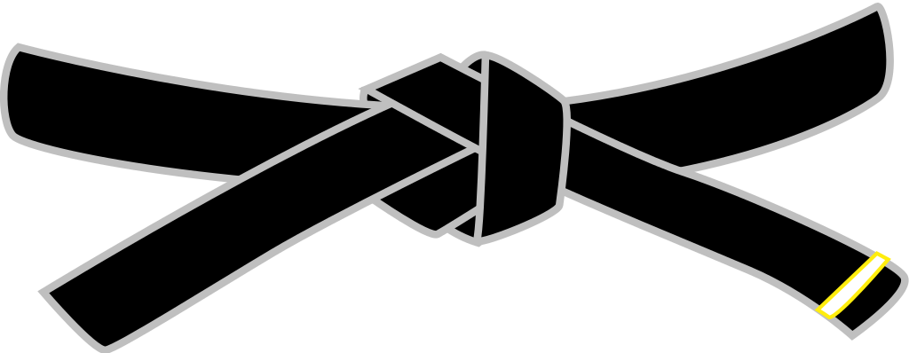
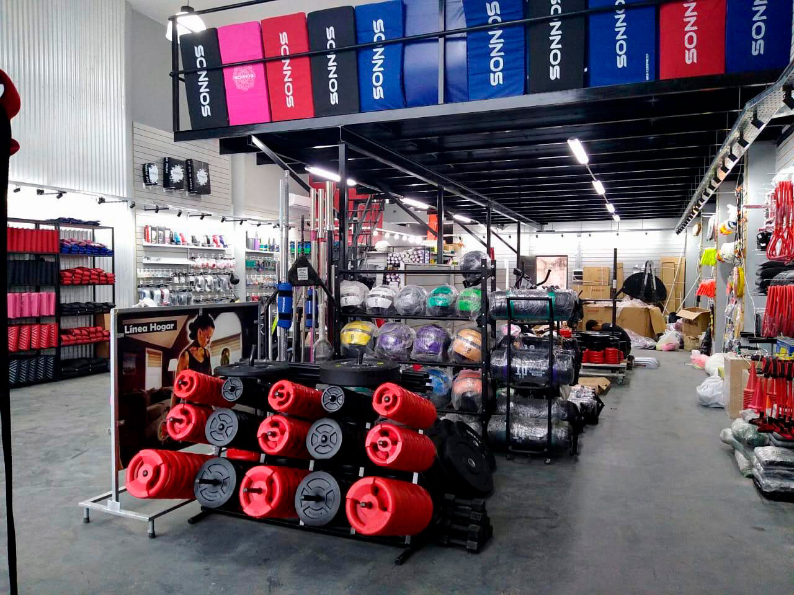
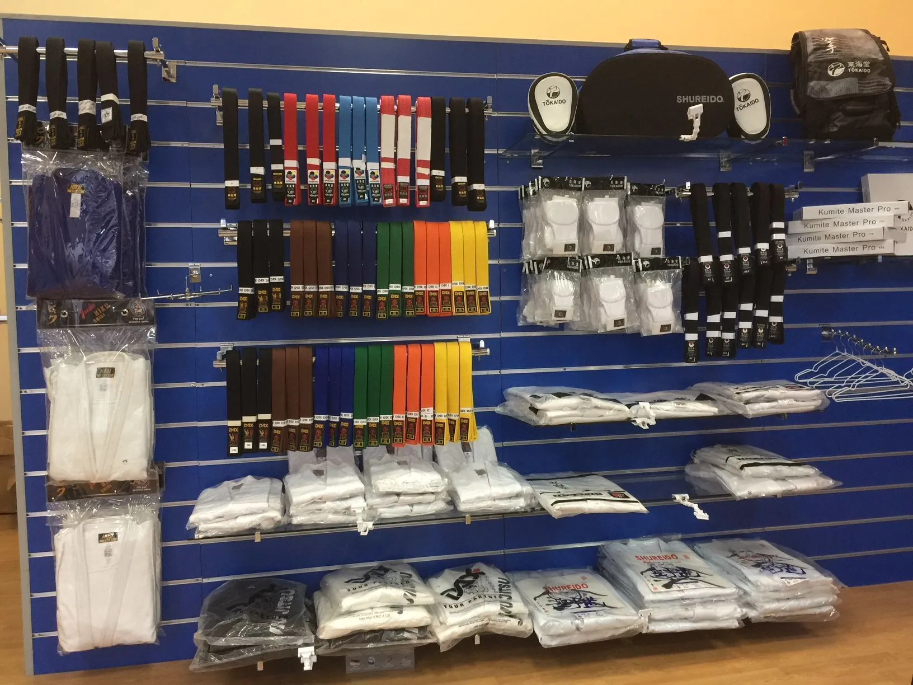

# PROYECTO 3: Landing de Negocio

En este proyecto se realiza una landing page para un negocio de una tienda ficticia, implementando HTML y CSS.

Link de Proyecto: [Mundo Marcial](https://diegocab27.github.io/Proyecto3/)


## Autor
- Diego Cabrera Carrasco  [@diegocab27](https://www.github.com/diegocab27)

## Planteamiento

El objetivo principal de este proyecto es desarrollar una interfaz utilizando HTML y CSS, en toda su aplicación. El proyecto debe cumplir con los siguientes requisitos:

- Prototipado simple.
- Etiquetas estándar HTML5.
- Implementar Css.

## Solución explicada paso a paso (HTML)

#### 1. Prototipado simple

Se crea un prototipado simple de lo que sera la pagina diseñado en la pagina  [draw.io](https://draw.io).


#### 2. Archivo HTML5

Creamos el archivo HTML señalando el title de `Mundo Marcial` en el `head` y enlazando el framework de `Bootstrap`.

```
<!DOCTYPE html>
<html lang="en">
<head>
    <meta charset="UTF-8">
    <meta name="viewport" content="width=device-width, initial-scale=1.0">
    <!-- Styles -->
    <link rel="stylesheet" href="index.css">
    <link href="https://cdn.jsdelivr.net/npm/bootstrap@5.3.3/dist/css/bootstrap.min.css" rel="stylesheet" integrity="sha384-QWTKZyjpPEjISv5WaRU9OFeRpok6YctnYmDr5pNlyT2bRjXh0JMhjY6hW+ALEwIH" crossorigin="anonymous">
    <title>Mundo Marcial</title>
</head>
```

#### 3. Archivo HTML5 (header)

Se crea la seccion `header` donde se aplica un `navbar` que se divide en las secciones del `menu`, `marca` y un `boton de busqueda`.

```
<header>
  <div class="nav__bar">
    <div class="menu_boton">
        <i class="bi bi-menu-down"></i>
        <b class="menu">Menú</b>
    </div>
    <div class="marca">
        
        <h1>Mundo Marcial</h1>
    </div>
    <nav class="navbar">
        <div class="container-fluid">
          <form class="d-flex" role="search">
            <input class="form-control me-2" type="search" placeholder="Buscar" aria-label="Search">
            <button class="btn btn-outline-success" type="submit">Buscar</button>
          </form>
        </div>
      </nav>
  </div>    
</header>
```

#### 4. Archivo HTML5 (main)

Creamos la seccion `main` la cual se divide con `mensaje principal` y un `carrusel` de imagenes.

```
<main>
  <div class="imagen__principal">
          <div class="intro">
             <h2 class="display-4" >
                Equipate como un guerrero
            </h2>
            <p>
                Encuentra con nosotros toda la indumentaria y los artículos deportivos que necesitas para dar lo mejor de ti.
            </p>
          </div>
            <div class="carrusel">
                <div id="carouselExampleAutoplaying" class="carousel slide" data-bs-ride="carousel">
                    <div class="carousel-inner">
                      <div class="carousel-item active">
                        
                      </div>
                      <div class="carousel-item">
                        
                      </div>
                      <div class="carousel-item">
                        
                      </div>
                    </div>
                    <button class="carousel-control-prev" type="button" data-bs-target="#carouselExampleAutoplaying" data-bs-slide="prev">
                      <span class="carousel-control-prev-icon" aria-hidden="true"></span>
                      <span class="visually-hidden">Previous</span>
                    </button>
                    <button class="carousel-control-next" type="button" data-bs-target="#carouselExampleAutoplaying" data-bs-slide="next">
                      <span class="carousel-control-next-icon" aria-hidden="true"></span>
                      <span class="visually-hidden">Next</span>
                    </button>
                  </div>
            </div>
        </div>
</main>

```


#### 5. Archivo HTML5 (Productos)

Se crea la seccion de `productos` y se divide en varias secciones `card` que seran las tarjetas con imagenes de los productos a mostrar.

```
<section class="productos">
          <div class="card" style="width: 18rem;">
              
              <div class="card-body">
                <h5 class="card-title">Dobok Adidas</h5>
                <p class="card-text">Creado para quienes deseen iniciar en el mundo del Taekwondo, resistente, muy ligera y cómoda para entrenar.</p>
                <a href="#" class="btn btn-success">$30.000</a>
              </div>
            </div>
            <div class="card" style="width: 18rem;">
              
              <div class="card-body">
                <h5 class="card-title">Guante de Boxeo Everlast </h5>
                <p class="card-text">El ajuste seguro mantiene la protección y la comodidad durante una variedad de ángulos al golpear.</p>
                <a href="#" class="btn btn-success">$33.000</a>
              </div>
            </div>
            <div class="card" style="width: 18rem;">
              
              <div class="card-body">
                <h5 class="card-title">Canillera Challenger Venum</h5>
                <p class="card-text">Espuma de alta densidad con almohadilla adicional en toda la canillera.
                  Ligeras en peso Marca en relieve y gráficos sofisticados.
                  Diseñado en Tailandia.</p>
                <a href="#" class="btn btn-success">$78.000</a>
              </div>
            </div>
</section>

```

#### 6. Archivo HTML5 (Footer)

Se crea la seccion `footer` la cual se divide en la seccion de `socials` para las redes sociales y la seccion ` reservado` para el mensaje de derechos reservados.y debajo aplicamos el `script` para `bootstrap`

```
<footer class="bg-grey bg-gradient">
  <div class="socials">
        <i class="bi bi-facebook"></i>
        <i class="bi bi-instagram"></i>
        <i class="bi bi-whatsapp"></i>
        <i class="bi bi-twitter-x"></i>
  </div>
  <div class="reservado">
    <p class="text-white"> 
    © TODOS LOS DERECHOS RESERVADOS
    </p>
  </div>

</footer>

<script src="https://cdn.jsdelivr.net/npm/bootstrap@5.3.3/dist/js/bootstrap.bundle.min.js" integrity="sha384-YvpcrYf0tY3lHB60NNkmXc5s9fDVZLESaAA55NDzOxhy9GkcIdslK1eN7N6jIeHz" crossorigin="anonymous"></script>

```

## Solución explicada paso a paso (CSS)


#### 1. importacion de fuentes

se importan las `fuentes` a utilizar en el proyecto 


```
@import url('https://fonts.googleapis.com/css2?family=Audiowide&display=swap');
@import url('https://fonts.googleapis.com/css2?family=Orbitron:wght@400..900&display=swap');
@import url("https://cdn.jsdelivr.net/npm/bootstrap-icons@1.11.3/font/bootstrap-icons.min.css");

```
#### 2. Diseño del navbar

Aplicamos la fuente para el titulo del `Navbar` y para la marca aplicamos `flex` para ajustar al centro junto con el `logo` ,tambien ajustamos el tamaño del y su posicion`menu`
por ultimo ajustamos el `Navbar` para que quede fijo y sobre lo demas que se muestre en pantalla 


```
h1{
    font-family: "Audiowide",sans-serif;

}

.marca{
    margin-left: 8%;
    display: flex;
    justify-content: center;
    align-content: center;
}

.menu_boton{
   cursor: pointer;
   font-size: 2rem;
   margin-left: 1vh;
}

.logo{
height: 3rem;
margin-right: 1vh;
}

.nav__bar{
display: flex;
align-items: center;
justify-content: space-between;
 background-color: white;
 width: 100%;
 top:0;
 position: fixed;
 height: 5rem;
 z-index: 9;
}
```
#### 3. Diseño del main

Se inserta una imagen de fondo para el `main` y se ajusta con un degradado de fondo cubriendo todo el ancho ,tambien se ajusta la fuente del `mensaje principal` y se ajusta la posicion que ocupara el `carrusel`. 


```
.imagen__principal{
display: flex;
align-items: center;
justify-content: space-evenly;
margin-top: 4vh;
width: 100%;
height: 30rem;
background-image:linear-gradient(rgb(255, 255, 255),rgba(22, 20, 20, 0.363)), url('assets/cinta.jpg');
background-repeat: no-repeat;
background-position: right;
background-color: rgba(255, 255, 255, 0.795);
}

.intro{
  width: 30rem;
  font-family: "Orbitron", sans-serif;
  font-size: 3vh;

}

.carrusel{
    display: flex;
    align-items: center;
    width: 60vh;
    margin-right: 30vh;
    margin-top: 5vh;

}

```

#### 4. Diseño de los productos

Se ajustan los tamaños para las `cards` que utilizaremos para los prodcutos a mostrar y se crea un diseño que transforma la escala de la tarjeta al pasar el mouse.


```
.productos{
    margin-top: 5vh;
    display: flex;
    justify-content: space-around;
    margin-bottom: 5vh;

}


.card:hover {
    transform: scale(1.1);
    box-shadow: 0px 0px 30px #71db7aa8;
    z-index: 9;
}

.card-img-top{
    height: 20rem;

}

.card-text{
    height: 7rem;
}
```


#### 5. Diseño del Footer

Se ajusta el tamaño del `footer` y se aplica `flex` para ajustar la posicion de los iconos de redes y el mesaje mostrado,tambien se da un diseño a los icono al pasar el mouse


```
footer{
    display: flex;
    align-items: center;
    height: 10vh;

}

.socials{
    display: flex;
    justify-content: space-around;
    color: aliceblue;
    font-size: 2vh;
    width: 15vh;
    margin-right: 30vh;
    margin-left: 2vh;

}

.socials > i:hover{

    color: rgb(86, 252, 20);
    text-shadow:0px 0px 10px #fff ;
    cursor: pointer;

}

.reservado{
display: flex;
align-items: center;
height: 10vh;
}
```
#### 5. Diseño Responsivo

Por ultimo aplicamos un diseño responsivo con `media screen` donde indicamos que al bajar los 1250 pixeles se ajustara el diseño de pagina.


```
@media screen and (max-width: 1250px) {

    .menu_boton{
        cursor: pointer;
        font-size: 1rem;
        margin-left: 1vh;
     }

    .nav__bar{
         height: 4rem;
         flex-wrap: nowrap;

        }

       .logo{
        height: 2rem;
        margin-top: 1vh;
        }
        .marca{
            display: flex;
            justify-content: center;
            align-content: center;
        }

        .intro{
         font-size: 2vh;
        }

        .imagen__principal{
            display: flex;
            flex-wrap: wrap-reverse;
        }
        .carrusel{
            display: flex;
            width: 30vh;
            margin-right: 0;
        
        }

        .productos{
            margin-top: 5vh;
            display: flex;
            flex-wrap: wrap;
            margin-bottom: 5vh;
        }
        .card{
          width: 5rem;
        }

       footer{
        flex-wrap: wrap;
        height: auto;
        justify-content: center;
        padding: 2vh;

        }
        
}
```
